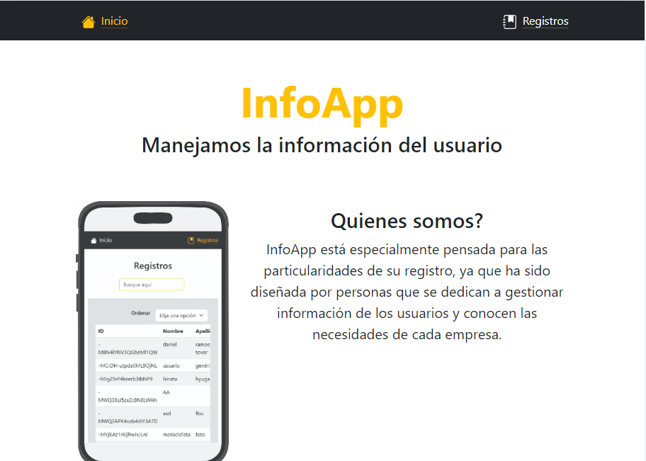
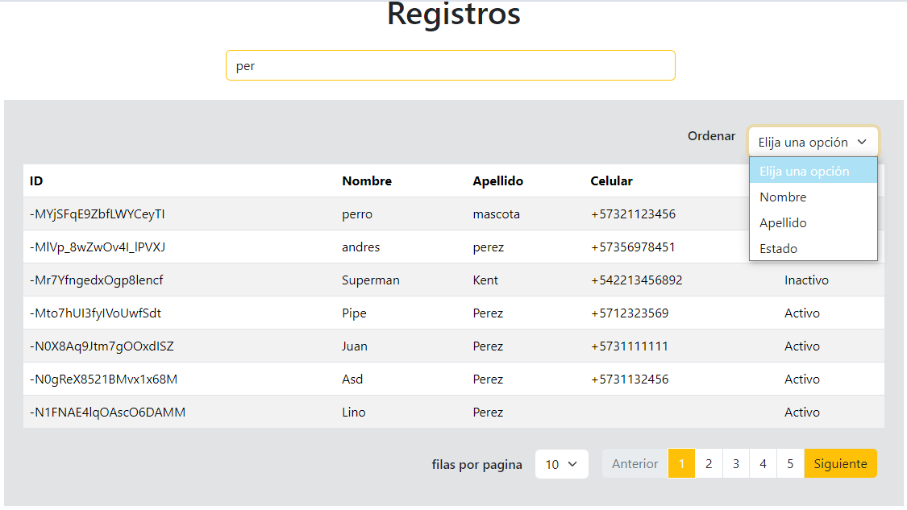
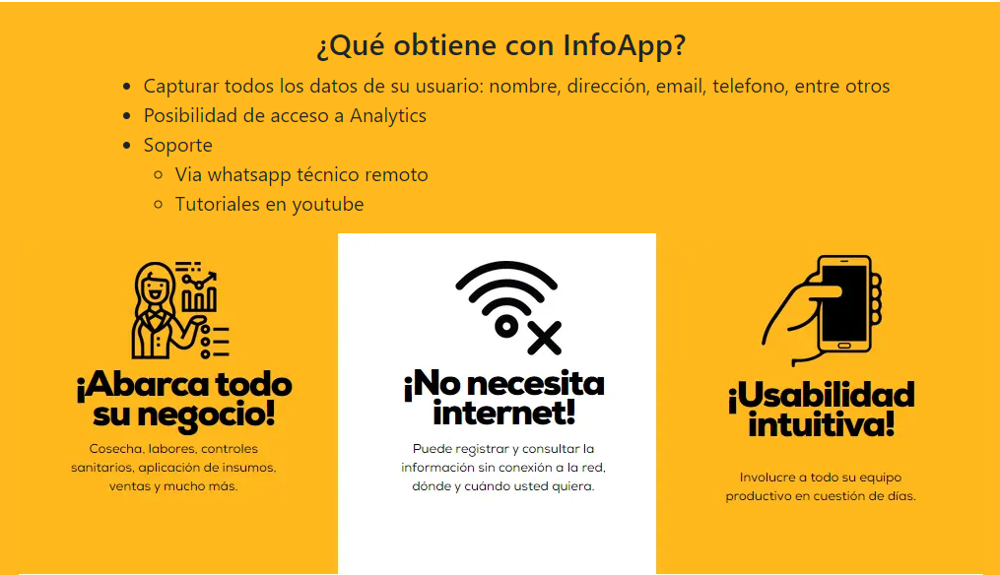
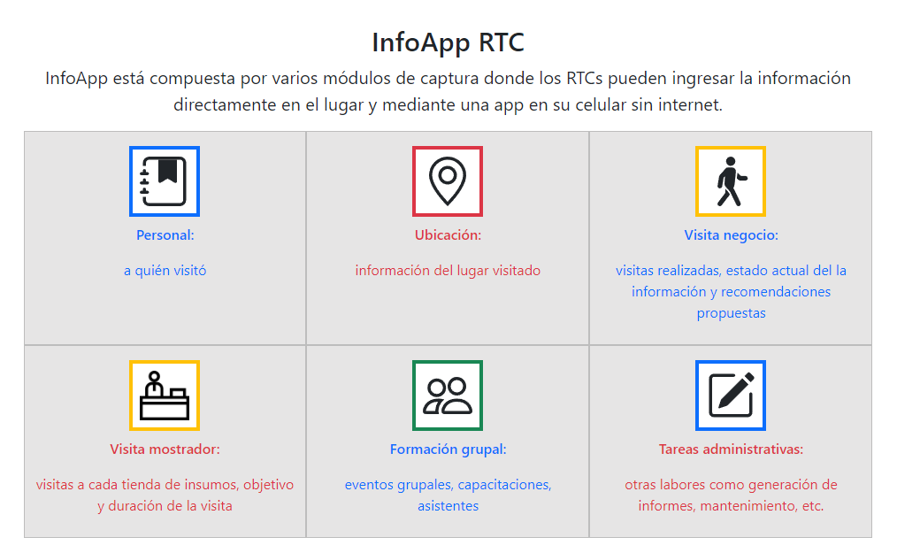
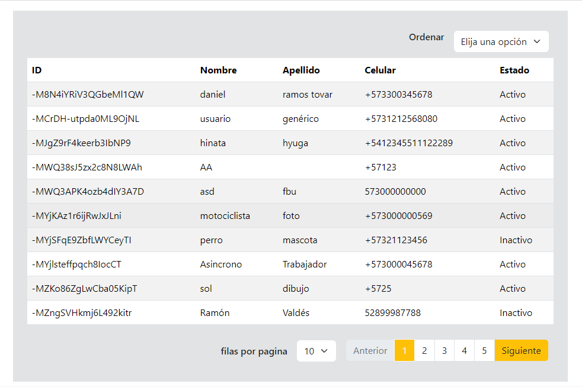
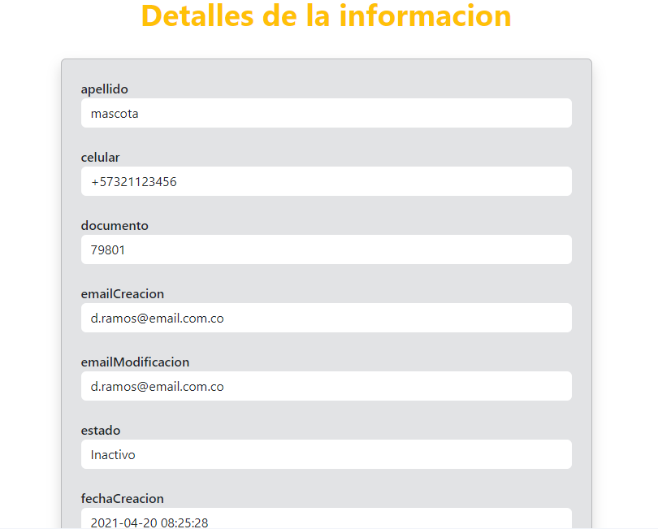

# InfoApp

    

## Proyecto

El proyecto cuenta con una pagina de inicio, una donde se muestran los registros y una donde se muestran los detalles del registro seleccionado. 

En la página de registro cuenta con varias funcionalidades, como lo son: 

- filtrar información: por medio de un input de busqueda el cual filtra por nombre, apellido, estado y id.

- ordenar: con un select tiene 3 opciones para ordenar, por nombre, por apellido y por estado (activo o inactivo)

- paginación: tiene la opción de mostrar de a 10 o de a 20 registros por página

    

El proyecto fue realizado con React.js y para los estilos Bootstrap. 

    

        
    

    

        
    

    

        
    

    

        
    

    

        
    

## Creado por

Adriana Maria Ruiz Henao
